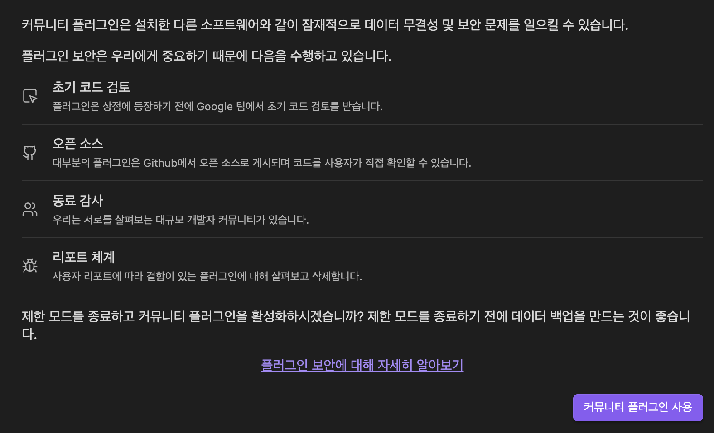

    
    <h1>Obsidian Template</h1>
    
내가 사용하는 Obsidian 설정 및 템플릿 모음

## 🚀 시작하기

[Obsidian](https://obsidian.md/)은 마크다운 문법으로 글을 작성할 수 있는 크로스 플랫폼 노트 앱입니다. Obsidian은 처음 사용하신다면 [15분만에 훑어보는 옵시디언 사용법 - 생산성 빌리언 시안](https://www.youtube.com/watch?v=ZuEu8SDqHOE)에서 간단한 사용법을 익힐 수 있습니다!

### 옵션 변경하기

#### 편집기

- **행 번호 표시**: 끄기 → 켜기

#### 파일 및 링크

- **삭제된 파일**: 시스템 휴지통으로 이동 → Obsidian 휴지통(.trash 폴더)으로 이동
- **내부 링크를 항상 업데이트**: 끄기 → 켜기
- **새 노트를 만들 위치**: 보관소의 최상위 폴더 → 아래에 지정된 폴더
  - 지정 폴더로 보관함으로 사용할 폴더로 지정해주세요. (ex. 보관함)
- **모든 파일 확장명 인식**: 끄기 → 켜기
- **새 첨부 파일을 만들 위치**: 보관소의 최상위 폴더 → 아래에 지정된 폴더
  - 첨부 파일을 저장할 폴더로 지정해주세요. (ex. 자료/이미지)

#### 테마

- **테마**: [AnuPpuccin](https://github.com/AnubisNekhet/AnuPpuccin)로 지정
  - 적용 방법은 [AnuPpuccin 옵시디언 테마: 최고의 디자인과 다양한 옵션](https://anpigon.tistory.com/332)을 참고해주세요.
  - 2023년 11월 이후로 업데이트가 진행되지 않아 언제든지 이슈가 생길 수 있습니다.
- **글꼴**: 인터페이스 글꼴, 텍스크 글꼴은 [Pretandard Variable](https://github.com/orioncactus/pretendard)로, 모노스페이스 글꼴은 Monaco로 설정
- **CSS 스니펫**: `vault/.obsidian/snippets` 경로에 2개 스니팻을 추가
  - [custom-separator.css](https://github.com/replete/obsidian-minimal-theme-css-snippets/blob/main/%5Bui%5D%20Custom%20Separators.css): 사이드바 폴더 사이에 구분자를 추가합니다.
  - [extended-colorschemes.css](https://github.com/AnubisNekhet/AnuPpuccin/blob/main/snippets/extended-colorschemes.css): 기본 테마 외 [AnuPpuccin](https://github.com/AnubisNekhet/AnuPpuccin)에서 제공하는 테마를 추가합니다.

#### 코어 플러그인

- **단어 개수**: 켜기 → 끄기
  - 커뮤니티 플러그인인 [Better Word Count](https://github.com/lukeleppan/better-word-count)로 대체합니다.

#### 데일리 노트

- **날짜 형식**: "YYYY-MM-DD [업무일지]"로 지정
- **새 파일 경로**: "업무일지"로 지정
- **템플릿 파일 경로**: "자료/템플릿/업무일지 템플릿"으로 지정

#### 커뮤니티 플러그인

"커뮤니티 플러그인 사용"을 허용해주세요.

### 플러그인 설치하기

<table>
    <thead>
        <tr>
            <th width="20%">플러그인</th>
            <th width="10%">필수</th>
            <th width="50%">사용 이유</th>
            <th width="20%">비고</th>
        </tr>
    </thead>
    <tbody>
        <tr>
            <th>[Better Word Count](https://github.com/lukeleppan/better-word-count)</th>
            <td>❌</td>
            <td>문서의 단어 개수 뿐만 아니라 드래그 영역의 단어 개수를 표시</td>
            <td>코어 플러그인 &quot;단어 개수&quot; 끄기</td>
        </tr>
        <tr>
            <th>[Calendar](https://github.com/liamcain/obsidian-calendar-plugin)</th>
            <td>🟢</td>
            <td>캘린더 인터페이스 및 특정 날짜의 데일리 노트 생성 기능 제공</td>
            <td>마지막 업데이트 3년 전</td>
        </tr>
        <tr>
            <th>[Custom File Explorer Sorting](https://github.com/SebastianMC/obsidian-custom-sort)</th>
            <td>🟢</td>
            <td>사이드바 폴더와 파일을 마음대로 정렬</td>
            <td></td>
        </tr>
        <tr>
            <th>[Dataview](https://github.com/blacksmithgu/obsidian-dataview)</th>
            <td>🟢</td>
            <td>vault를 데이터베이스처럼 쿼리할 수 있고 JavaScript API를 제공함</td>
            <td></td>
        </tr>
        <tr>
            <th>[File Explorer Note Count](https://github.com/ozntel/file-explorer-note-count)</th>
            <td>❌</td>
            <td>사이드바 폴더에 자료 개수를 표시</td>
            <td>마지막 업데이트 1년 전</td>
        </tr>
        <tr>
            <th>[Folder Notes](https://github.com/LostPaul/obsidian-folder-notes)</th>
            <td>🟢</td>
            <td>폴더에 인덱스 파일을 생성할 수 있음</td>
            <td>다운로드 수가 높은 xpgo의 Folder Note는 더이상 개발되지 않아 이 플러그인으로 설치</td>
        </tr>
        <tr>
            <th>[Git](https://github.com/denolehov/obsidian-git)</th>
            <td>❌</td>
            <td>Git을 사용한 싱크 기능 제공</td>
            <td></td>
        </tr>
        <tr>
            <th>[Style Settings](https://github.com/mgmeyers/obsidian-style-settings)</th>
            <td>❌</td>
            <td>CSS 스니펫의 설정을 쉽게 변경할 수 있는 인터페이스 제공</td>
            <td>[AnuPpuccin](https://github.com/AnubisNekhet/AnuPpuccin)에서 제공하는 추가 설정 수정 시 필요</td>
        </tr>
    </tbody>
</table>

## 💬 사용하기

## 📚 참고 자료
